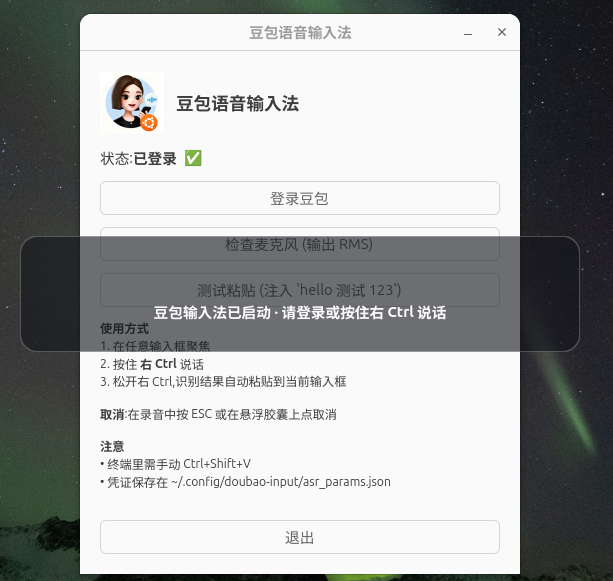

# 豆包语音输入法 for Linux

> 在 Ubuntu / GNOME / Wayland 上,**按住右 Ctrl 说话,松开就把识别出的文字输入到当前输入框**。

本项目把豆包(Doubao)Web 版的语音识别能力做成一个常驻的全局语音输入法,
专为原生 Wayland / GNOME 设计,避开 xdotool 在 Wayland 下失效、`wtype` 依赖 virtual-keyboard 协议
(Mutter 不实现)等问题。本项目从零实现豆包逆向逻辑(登录、WebSocket ASR、音频采集)以及触发、注入与 UI。

详细设计见 [`docs/design.md`](docs/design.md)。

---

## 📸 截图

**项目图标**(128×128,安装到 hicolor,launcher 立即生效):


**控制窗口** —— 启动 app 后的主面板:登录态、麦克风测试、注入测试、使用说明、退出按钮。



> 图标 + 启动 app 界面均来自 v1.0.1 真实运行环境(已在 Ubuntu 25.04 / GNOME 48 / Wayland 实测)。

---

## ✨ 特性

- **按住即说,松手即输** —— push-to-hold 交互,右 Ctrl 物理键触发。
- **GNOME / Wayland 原生可用** —— 用 `evdev` 监听 + `uinput` 模拟,不依赖 X11/XWayland。
- **中文 OK** —— 走剪贴板 + 模拟 Ctrl+V,不靠逐键输入。
- **圆角胶囊悬浮窗** —— 18px 圆角 + 1.5px 白边 + 呼吸 alpha(0.78~0.98 / 2.4s 周期)
  + 每识别出新字触发 220ms 流光闪烁;文字始终纯白粗体不参与动效,保证可读。
- **会话常驻** —— `systemd --user` 自启;再次启动唤起控制窗口(单实例)。
- **凭证本地化** —— 登录一次,凭证写在 `~/.config/doubao-input/doubao_params.json`,复用至下次。
- **零 sudo 运行** —— 仅需把用户加入 `input` 组(`.deb` 的 `postinst` 自动处理)。

---

## 📦 系统要求

| 组件 | 要求 |
|---|---|
| 操作系统 | Ubuntu 25.04 / GNOME 48 / Wayland(已在该环境实测) |
| Python | 3.13 |
| 音频 | PipeWire / PulseAudio(系统自带) |
| 用户组 | 当前用户需在 `input` 组(访问 `/dev/input/event*` 与 `/dev/uinput`) |

---

## 🛠️ 安装

### 普通用户(用 .deb)

`.deb` 在 [`Releases`](https://github.com/wurong98/doubao-input-for-linux/releases)
下载,或在仓库根跑 `bash packaging/build-deb.sh` 自打。**只需两步**:

```bash
# 1. 装 .deb
sudo apt install ./doubao-input_1.0.2-1_all.deb
#   apt 会自动从 Depends 拉所有系统包(下面"完整依赖清单")
#   postinst 会自动:
#     - 把当前 sudo 用户加进 input 组
#     - 创建用户级 venv 并 pip install 3 个 PyPI-only 包

# 2. 重新登录(让 input 组生效)→ 然后跑
doubao-input
# 或开机自启:
systemctl --user enable --now doubao-input.service
```

**完整 apt 依赖清单**(ubuntu 25.04+ 仓库,`.deb` 的 `Depends` 字段):

| 包 | 用途 |
|---|---|
| `python3-gi` | PyGObject(GTK 绑定) |
| `gir1.2-gtk-4.0` | GTK 4 typelib |
| `gir1.2-webkit-6.0` | WebKitGTK 6.0 typelib(登录窗口) |
| `libgtk-4-1` | GTK 4 运行时 |
| `libwebkitgtk-6.0-4` | WebKitGTK 6.0 运行时 |
| `wl-clipboard` | `wl-copy` / `wl-paste`(剪贴板读写) |
| `init-system-helpers` | systemd 工具 |
| `python3-pip` *(Recommends)* | postinst 装 venv 用 |
| `python3-venv` *(Recommends)* | postinst 创建 venv 用 |

**3 个 PyPI-only 依赖**(不在 apt,postinst 自动装到 `~/.local/share/doubao-input/.venv`):
`websockets` / `sounddevice` / `evdev`

> ⚠️ **必须重新登录**让 `input` 组生效,否则 evdev 读不到 `/dev/input/event*`、uinput 写不到 `/dev/uinput`,app 启动会立即报错。

### 开发(从源码)

```bash
git clone https://github.com/wurong98/doubao-input-for-linux.git
cd doubao-input

# 1. 系统依赖(同 .deb 依赖,这里要手动装)
sudo apt install python3-gi gir1.2-gtk-4.0 gir1.2-webkit-6.0 \
                 libgtk-4-1 libwebkitgtk-6.0-4 wl-clipboard

# 2. 进 input 组
sudo usermod -aG input $USER
#   ⚠️ 重登

# 3. venv + Python 依赖
python3 -m venv .venv
.venv/bin/pip install -r requirements.txt
#   requirements.txt 内容: websockets, sounddevice, evdev

# 4. 跑
./start.sh
#   等价于 PYTHONPATH=src .venv/bin/python -m doubao_input
```

### 首次使用

启动后弹出**登录窗口**,用 WebKitGTK 加载豆包网页;在 WebView 里登录成功后,
JS 拦截到登录态,自动从 `/alice/profile/self` 抓 cookies + 从 `localStorage` 抓 `device_id` / `web_id`,
写入 `~/.config/doubao-input/doubao_params.json`,登录窗口自动关闭。

之后按下右 Ctrl 即可:

- **按下**:弹出波形胶囊悬浮窗,实时显示识别文字
- **松开**:等待 1s 安全超时(收齐末尾识别结果),把文字 `wl-copy` 写剪贴板 + `uinput` 发 Ctrl+V → 落入当前输入框
- **按住 <150ms**:视为误触,取消,不注入

---

## 🧑‍💻 开发

### 项目结构

```
src/doubao_input/
├── __main__.py            入口 (`python -m doubao_input`)
├── app.py                 GtkApplication 生命周期 + 组件编排
│
├── doubao/                豆包逆向逻辑核心模块
│   ├── asr_client.py       WSS 客户端
│   ├── audio_capture.py     sounddevice 16kHz/mono/int16 采集 + RMS 回调
│   ├── params_store.py      凭证持久化 (JSON)
│   ├── config.py            固定参数、路径、超时
│   ├── app_state.py         GObject 可观察状态
│   ├── login_window.py      WebKitGTK 登录 + JS 拦截凭证
│   └── host_tools.py        wl-copy / xclip 候选命令
│
├── trigger/evdev_ptt.py   ← 自研:右 Ctrl 物理键监听
├── inject/injector.py     ← 自研:wl-copy + uinput Ctrl+V
├── login/resources/        注入到 WebView 的 JS
└── ui/                    ← 自研:界面
    ├── overlay.py          顶部波形胶囊悬浮窗
    └── control_window.py   控制 / 登录入口窗口
```

### 模块分工

`trigger/`、`inject/`、`ui/`、`doubao/`、`app.py`、`__main__.py` 是本项目原创模块,各司其职。

### 探针测试

`tests/probe/` 是验证豆包登录与 ASR 链路是否仍可用的最小探针(非产品代码):

```bash
# P5: 登录豆包,写凭证
.venv/bin/python tests/probe/P5_login.py

# P6: 用凭证连 WSS,录 5 秒,看是否返回 result.Text
.venv/bin/python tests/probe/P6_asr.py
```

每个高风险环节(依赖、evdev、uinput、音频、剪贴板、登录、ASR)在
[`docs/design.md`](docs/design.md) §9 都有验证方法。开发期应先跑通 P5/P6 再动产品代码。

### 日志

启动时 `INFO` 级别,关键事件都有日志:

```
on_activate: setup_done=False
build complete
EvdevPtt started on N device(s)
WS open, 开始录…
result: 今天天气怎么样
clipboard: wl-copy ok
paste: uinput ok (shift=False, gap=12ms)
```

调试:把 `logging.basicConfig(level=logging.DEBUG)` 改成 DEBUG 即可看到 evdev 设备扫描等细节。

---

## 📤 打包

提供 `.deb` 包 + systemd user service 常驻,版本号见
[`debian/changelog`](debian/changelog)。

```bash
# 打包(在仓库根)
bash packaging/build-deb.sh
# → 生成 doubao-input_<version>_all.deb

# 安装
sudo dpkg -i doubao-input_*.deb
# postinst 会自动:
#   - 把当前用户加入 input 组(需要重新登录)
#   - 创建用户级 venv: ~/.local/share/doubao-input/.venv
#   - 装 Python 依赖: websockets / sounddevice / evdev
#   - 拷贝头像到 hicolor 图标主题
#   - 拷贝 .desktop / .service

# 启动
doubao-input                          # 直接跑
systemctl --user enable --now doubao-input.service  # 开机自启
```

打包细节见 [`docs/design.md`](docs/design.md) §7。

---

## ⚠️ 已知限制

- **终端粘贴需 Ctrl+Shift+V**:Wayland 下拿不到前台窗口类名,v1 默认 Ctrl+V;终端里若粘贴失败,
  文字仍在剪贴板,可手动 Ctrl+Shift+V。终端模式作为后续可配置开关。
- **托盘在 GNOME 48 默认不可见**:GNOME 48 默认不显示 StatusNotifierItem 托盘,
  需 AppIndicator 扩展;否则静默降级,功能不受影响,引导用控制窗口。
- **豆包接口变动风险**:豆包 Web 版接口一旦变更,ASR 会失效;凭证失效会触发自动重登。
- **剪贴板被覆盖**:每次粘贴覆盖系统剪贴板。

---

## 📝 变更历史

完整历史见 [`debian/changelog`](debian/changelog)。近期主要变更:

### v1.0.2(2026-06-21)

- **Logo 透明背景** — 把白底的 logo.png / logo-128.png 替换为
  RGBA 真透明版本(角点 alpha=0)。launcher 图标不再有
  白色方框,README 头像不再有白色描边。版本号 bump 因为
  这是用户视觉层的修复,虽然不是功能改动。

### v1.0.1(2026-06-21)

- **PttOverlay 视觉升级** — 18px 圆角 + 半透明深色面板 + 1.5px 白边 +
  呼吸 alpha(2.4s 周期,0.78~0.98)+ 敲击触发 220ms 流光闪烁。
  文字高对比度、纯白粗体,动效不作用于文字。
- **5 个排版 bug 修复** —
  - 锁 label 硬宽 360px,修「你好依旧两行」(Pango 0 字符宽时单字一行 bug)
  - 改 box 为 VERTICAL,修「文字偏右」(之前 HORIZONTAL,label 跟在 wave 右边)
  - 删 set_ellipsize(START),修「整行变 …」(wrap+ellipsize+CJK Pango bug)
  - 退回单 widget 树,修「文字看不到」(Gtk.Overlay.add_overlay 位置 bug)
  - box 撑满 window + CSS `window { background: none }`,修「白方块背景」
- **launcher 图标修复** — `.desktop` 的 `Icon=` 改用绝对路径,绕过
  GNOME Shell 的 per-session icon-theme cache,launcher 立即生效
  无需重登。

### v1.0.0(2026-06-21)

- 初版发布。push-to-hold 全局语音输入法(.deb + systemd user service)。

---

## 📄 许可证

MIT — 见 [`LICENSE`](LICENSE)。